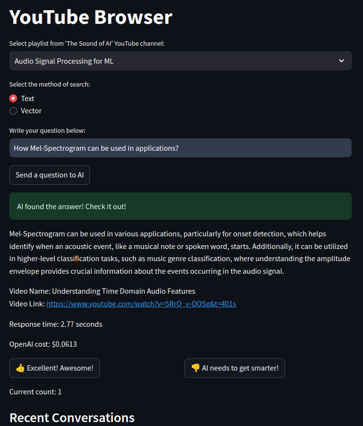
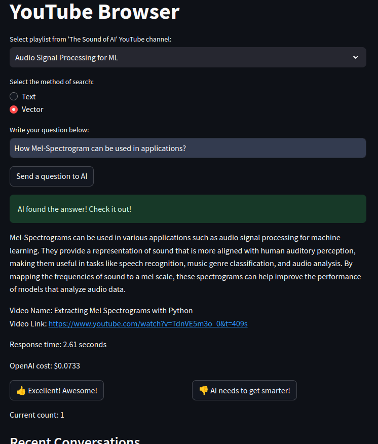
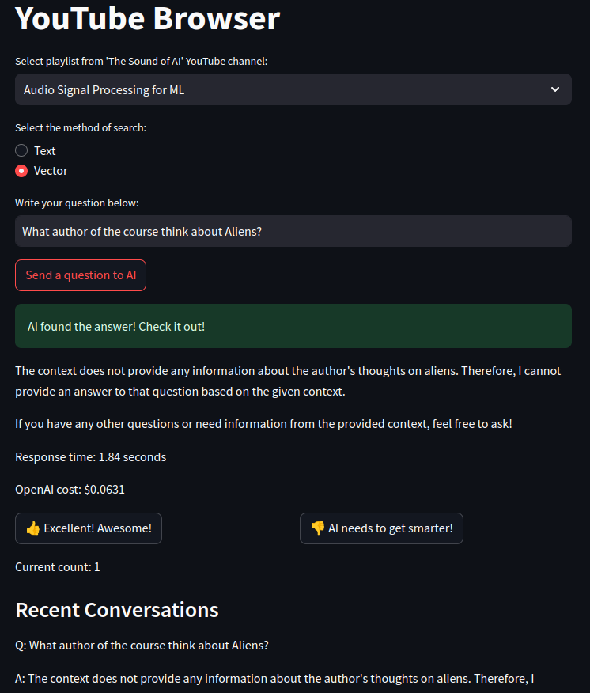

# YouTube Browser

AI assistant that will help you gain knowledge from "The Sound of AI" YouTube channel on how to process audio signal for creating audio apps like Generative Music AI app, Audio Signal Processing, Sound Generation using Neural Networks, Deep Learning in Audio apps, etc. This project was created as a part of the LLM Zoomcamp course.

## Background

It is known that the YouTube platform contains a huge amount of information, which is quite difficult to get using the classic and familiar search methods that we are used to using, such as Google search. To search for information on YouTube, you need to not only find the desired video, but also watch it, which requires a lot of time. For this reason, the YouTube platform is used mainly as an entertainment platform. However, there are a huge number of educational and informative videos from which we would really like to draw information as in a regular Google search engine.

## Goal of the project

The main goal of this project is to create an AI assistant that could search for information in the content of YouTube videos and return back human-readable answers, as if we were looking for information in a regular search engine.

## Solution

As part of this project, an AI-Audio-Assistant was created, which provides the ability to search for information in YouTube playlists, such as in the Google search engine. AI-Audio-Assistant is a Retrieval Augmented Generation application, the main goal of which is to provide answers for user questions based on content in YouTube videos.
The information in the AI-Audio-Assistant knowledge base contains transcribed audio files from two playlists, "Audio Deep Learning with Python" and "Audio Signal Processing for ML", from The Sound of AI channel. These playlists contain technical information on how to work with audio files, how to process an audio signal using popular Python libraries, what physical parameters an audio signal has, how to apply Deep Learning models to build AI applications based on neural networks, etc.
As part of the project, code was written that allows you to download audio tracks from YouTube video playlists and transcribe them using the Amazon Transcribe service. As a result, transcripts of the video content were obtained with time codes, as well as broken down into chunks. However, one chunk does not always contain complete information to answer a question. For this reason, the resulting dataset was transformed so that each chunk also contained information from the two following chunks. In addition, 10 questions were generated for the contents of each chunk using LLM and also added to the dataset. In the future, based on the search for the generated questions, as well as the contents of the chunks, the ranking of answers will be performed using ElasticSearch.

## Examples of questions and answers from RAG system

Firstly, the question which is relevant to the playlist information (Text and Vector search).

Secondly, the question which author didn't cover in his videos (Text and Vector search).

